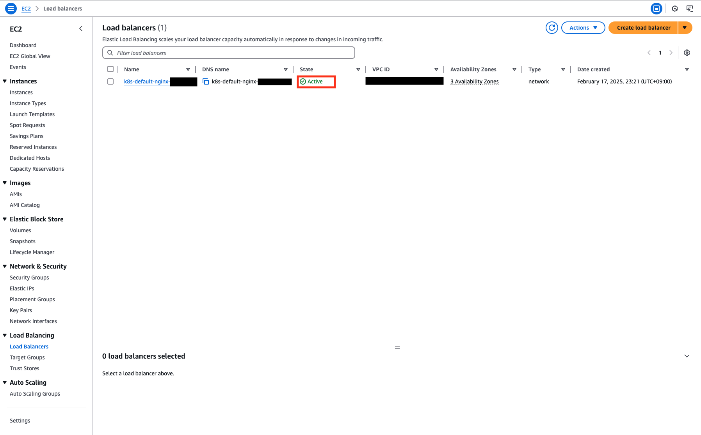

# ハンズオン内容

## 0. ハンズオン準備

### 0-1. codespaceの起動

左上のボタンをクリックし、「Codespaces」をクリックします。


「New codespace」をクリックします。


Repositoryに「k8s-meetup-novice/eks-handson-20250218」を選択し、「Create codespace」をクリックします。


### 0-2. AWSの認証情報払い出し

IAM > User に移動します。


Userをクリックし、詳細画面に移動します。


Access keysまでスクロールダウンし、「Create access key」をクリックします。


「Command Line Interface (CLI)」を選択し、一番下のチェックボックスにチェックをいれ、「Next」をクリックします。


「eks-wakaran-handson」と入力し、「Create access key」をクリックします。


表示された「Access key」および「Secret access key」を控え、「Download .csv file」をクリックした後、「Done」をクリックします。


## 1. EKSおよびECR, S3の作成

以下のコマンドを用いて、環境変数を設定します。
```
export AWS_ACCESS_KEY_ID=xxxx
export AWS_SECRET_ACCESS_KEY=xxxx
export AWS_DEFAULT_REGION=ap-northeast-1
export TF_VAR_aws_access_key="${AWS_ACCESS_KEY_ID}"
export TF_VAR_aws_secret_key="${AWS_SECRET_ACCESS_KEY}"
```

以下のコマンドを用いて、リソース作成計画が「Plan: 62 to add, 0 to change, 0 to destroy.」という形で表示されることを確認します。

```
cd tffiles
make plan
```

次に、make applyコマンドを用いてリソースの作成を実行します。

```
make apply
```

以下のような確認が求められるので`yes`と入力します。

```
...
Do you want to perform these actions?
  Terraform will perform the actions described above.
  Only 'yes' will be accepted to approve.

  Enter a value: yes <--- ここでyesと入力してください
```

コマンドの実行が正常に完了すると、以下のように表示されます。(コマンドの実行には約10~15分程度要します。)

```
Apply complete! Resources: 62 added, 0 changed, 0 destroyed.

Outputs:

cluster_endpoint = "https://XXXXXXX.ap-northeast-1.eks.amazonaws.com"
cluster_name = "eks-wakaran-handson-cluster"
cluster_security_group_id = "sg-XXXXXXXXX"
region = "ap-northeast-1"
```

EKSおよびECR, S3が作成されたことを確認します。


## 2. アプリケーション作成及びLBでアクセス

### 2-1. EKSへのアクセス

以下のコマンドを用いて、kubeconfigを取得します。

```
aws eks update-kubeconfig --name eks-wakaran-handson-cluster
```

kubectlでNodeが表示されることを確認します。

```
$ kubectl get nodes
NAME                                              STATUS   ROLES    AGE   VERSION
ip-172-17-1-126.ap-northeast-1.compute.internal   Ready    <none>   17m   v1.30.8-eks-aeac579
ip-172-17-3-204.ap-northeast-1.compute.internal   Ready    <none>   18m   v1.30.8-eks-aeac579
```

### 2-2. Load Balancer Controllerのデプロイ

scriptsディレクトリに移動し、「deploy_lb_controller.sh」を実行します。

```
bash deploy_lb_controller.sh
```

aws-load-balancer-controllerで始まるPodが作成されていることを確認します。
```
$ kubectl get pods -n kube-system
NAME                                           READY   STATUS    RESTARTS   AGE
aws-load-balancer-controller-b7d6fcc45-9bc9r   1/1     Running   0          23s
aws-load-balancer-controller-b7d6fcc45-kh776   1/1     Running   0          23s
aws-node-5ndf2                                 2/2     Running   0          6m44s
aws-node-dcdxh                                 2/2     Running   0          6m30s
coredns-5d797594d7-hrp5m                       1/1     Running   0          9m45s
coredns-5d797594d7-qn8z2                       1/1     Running   0          9m45s
kube-proxy-7zmcs                               1/1     Running   0          6m30s
kube-proxy-sqj86                               1/1     Running   0          6m44s
```

### 2-3. 外部からPodへのアクセス

nginxを作成します。

```
kubectl run nginx --image nginx -n default
```

Podが正常に起動したことを確認します。

```
$ kubectl get pods
NAME    READY   STATUS    RESTARTS   AGE
nginx   1/1     Running   0          97s
```


次に作成したnginxに対して外部よりアクセスするためのServiceを作成します。

以下のマニフェストが、scriptsというディレクトリに`service.yaml`というファイルで保存されています。

```
apiVersion: v1
kind: Service
metadata:
  name: nginx
  namespace: default
  annotations:
    service.beta.kubernetes.io/aws-load-balancer-type: "external"
    service.beta.kubernetes.io/aws-load-balancer-nlb-target-type: "instance"
    service.beta.kubernetes.io/aws-load-balancer-scheme: "internet-facing"
  labels:
    run: nginx
spec:
  ports:
  - port: 80
    protocol: TCP
    targetPort: 80
  selector:
    run: nginx
  type: LoadBalancer
```

このマニフェストを適用します。

```
kubectl apply -f scripts/service.yaml
```


kubectlを用いてServiceリソースを参照し、外部からアクセスするためのFQDNを取得します。

```
$ kubectl get svc
NAME         TYPE           CLUSTER-IP      EXTERNAL-IP                                                                      PORT(S)        AGE
kubernetes   ClusterIP      10.100.0.1      <none>                                                                           443/TCP        15m
nginx        LoadBalancer   10.100.145.91   k8s-default-nginx-xxxxxxxxxxx-yyyyyyyyyyyyyyyyy.elb.ap-northeast-1.amazonaws.com   80:31751/TCP   7s
```


Load BalancerがActiveになったことを確認します。




控えていたFQDNにアクセスをし、nginxの画面が表示されることを確認します。


## 3. ECRからのPull

nginxのコンテナイメージをPullします。

```
docker pull nginx
```

aws cliとdocker cliを用いて、ECRにログインします。

```
ACCOUNT_ID=`aws sts get-caller-identity | jq -r '.Account'`
aws ecr get-login-password --region ap-northeast-1 | docker login --username AWS --password-stdin ${ACCOUNT_ID}.dkr.ecr.ap-northeast-1.amazonaws.com
```

Pullしたイメージにタグ付けをします。

```
docker tag nginx ${ACCOUNT_ID}.dkr.ecr.ap-northeast-1.amazonaws.com/eks-wakaran-handson-ecr:aws-waiwai
```

ECRにローカルのイメージをPushします。

```
docker push ${ACCOUNT_ID}.dkr.ecr.ap-northeast-1.amazonaws.com/eks-wakaran-handson-ecr:aws-waiwai
```

GUIから確認します。


最後に、PushしたECR上のイメージをEKS上で利用します。

```
kubectl run nginx-from-ecr --image ${ACCOUNT_ID}.dkr.ecr.ap-northeast-1.amazonaws.com/eks-wakaran-handson-ecr:aws-waiwai -n default
```

作成したPodが起動していることを確認します。

```
$ kubectl get pods
NAME             READY   STATUS    RESTARTS   AGE
nginx            1/1     Running   0          7h10m
nginx-from-ecr   1/1     Running   0          34s
```


## 4. IRSA
EKSでは[IRSA](https://docs.aws.amazon.com/eks/latest/userguide/iam-roles-for-service-accounts.html)と呼ばれる仕組みにより、Kubernetesの[ServiceAccount](https://kubernetes.io/docs/concepts/security/service-accounts/)にAWSのIAMロールを紐づけることで、PodからAWSのサービスにアクセスすることができます。
ここではIRSAを利用して、EKSにデプロイしたPodからS3のバケットにアクセスします。

以下のコマンドを用いて、S3のバケット名を取得します。

```
S3_BUCKET_NAME=$(aws s3 ls | grep eks-wakaran-handson-s3 | awk '{print $3}')
```

echoコマンドを用いて、S3のバケット名が取得できていることを確認します。

```
$ echo $S3_BUCKET_NAME
eks-wakaran-handson-s3-*****
```

S3にファイルを入ます。

```
touch test.txt
aws s3 cp test.txt s3://${S3_BUCKET_NAME}
```

以下のような出力が出ることを確認します。

```
（コマンド実行結果 [例]）
$ aws s3 cp test.txt s3://${S3_BUCKET_NAME}
upload: ./test.txt to s3://eks-wakaran-handson-s3-*****/test.txt
```

S3の中にファイルがアップロードされていることを確認します。


それでは、S3バケットの中身を参照できるか確認しましょう。

以下のコマンドを用いて、マニフェストを作成します。

```
cat << EOF > scripts/pod-before.yaml
apiVersion: v1
kind: Pod
metadata:
  name: pod-before
  namespace: default
spec:
  containers:
    - name: my-aws-cli
      image: amazon/aws-cli:latest
      args: ['s3', 'ls', '${S3_BUCKET_NAME}']
  restartPolicy: Never
EOF
```

以下のようなマニフェストが、scriptsというディレクトリに`pod-before.yaml`というファイルで保存されました。

```
apiVersion: v1
kind: Pod
metadata:
  name: pod-before
  namespace: default
spec:
  containers:
    - name: my-aws-cli
      image: amazon/aws-cli:latest
      args: ['s3', 'ls', 'eks-wakaran-handson-s3-*****']
  restartPolicy: Never
```

このマニフェストを適用します。

```
kubectl apply -f scripts/pod-before.yaml
```


PodがErrorとなっていることを確認します。

```
$ kubectl get pods
NAME             READY   STATUS    RESTARTS   AGE
nginx            1/1     Running   0          7h46m
nginx-from-ecr   1/1     Running   0          36m
pod-before       0/1     Error     0          8s
```

以下のコマンドを用いてPodのログを確認し、エラーログが確認します。

```
$ kubectl logs pod-before
is not authorized to perform: s3:ListBucket on resource: "arn:aws:s3:::eks-wakaran-handson-s3-trg98" because no identity-based policy allows the s3:ListBucket action
```

これは、このPodにS3バケットを参照する権限がないことを示しています。

では、PodからS3のバケット内にあるファイルを参照することができるように、IRSAを利用するためのサービスアカウントとIAMロールをeksctlを用いて作成します。

まず、IAM OIDCプロバイダーを作成します。

```
eksctl utils associate-iam-oidc-provider --region=ap-northeast-1 --cluster=eks-wakaran-handson-cluster --approve
```

次に、サービスアカウントを作成します。

このサービスアカウントに紐づくIAMロールには、「S3読み取り許可」ポリシーをアタッチしています。

```
eksctl create iamserviceaccount \
  --name eks-wakaran-handson-sa \
  --namespace default \
  --cluster eks-wakaran-handson-cluster \
  --approve \
  --attach-policy-arn $(aws iam list-policies --query 'Policies[?PolicyName==`AmazonS3ReadOnlyAccess`].Arn' --output text) 
```
  
以下のような出力が出ることを確認します。

```
2024-11-14 00:21:52 [ℹ]  created serviceaccount "default/eks-novice-handson-sa"
```

それでは、今回作ったサービスアカウントを利用してPodを新たに起動します。

以下のコマンドを用いて、マニフェストを作成します。

```
cat << EOF > scripts/pod-after.yaml
apiVersion: v1
kind: Pod
metadata:
  name: pod-after
  namespace: default
spec:
  serviceAccountName: eks-wakaran-handson-sa
  containers:
    - name: my-aws-cli
      image: amazon/aws-cli:latest
      args: ['s3', 'ls', '${S3_BUCKET_NAME}']
  restartPolicy: Never
EOF
```

以下のようなマニフェストが、scriptsというディレクトリに`pod-after.yaml`というファイルで保存されました。

```
apiVersion: v1
kind: Pod
metadata:
  name: pod-after
spec:
  serviceAccountName: eks-wakaran-handson-sa
  containers:
    - name: my-aws-cli
      image: amazon/aws-cli:latest
      args: ['s3', 'ls', 'eks-wakaran-handson-s3-*****']
  restartPolicy: Never
```

このマニフェストを適用します。

```
kubectl apply -f scripts/pod-after.yaml
```

今回作成したPodがCompletedとなっていることを確認します。

```
$ kubectl get pods
NAME             READY   STATUS      RESTARTS   AGE
nginx            1/1     Running     0          7h56m
nginx-from-ecr   1/1     Running     0          46m
pod-after        0/1     Completed   0          45s
pod-before       0/1     Error       0          7m22s
```

以下のコマンドを用いてPodのログを確認し、S3の中身を参照できたことを確認します。

```
$ kubectl logs pod-after
2024-11-14 00:03:21          0 test.txt
```

## 5. クリーンアップ

1. ECRにあるコンテナイメージの削除
2. S3のバケット内にあるファイルの削除
3. Serviceの削除

```
$ kubectl delete -f /workspaces/eks-handson-private/scripts/service.yaml
```

コマンドを実行後、GUIでLoad Balancerが削除されていることを確認します。

4. リソースの削除

```
$ cd /workspaces/eks-handson-private/tffiles

$ make destroy

...

Do you really want to destroy all resources?
  Terraform will destroy all your managed infrastructure, as shown above.
  There is no undo. Only 'yes' will be accepted to confirm.

  Enter a value: yes <--- ここでyesと入力してください
```

5. IAMのPolicies及びRolesにて、「wakaran」というワードの入った名前のリソースを削除

6. IAMのUserにてハンズオンに使用したユーザー名を選択し、ハンズオン用に作成したAccess key(Description: `eks-wakaran-handson`)を無効化および削除

7. codespaceの削除