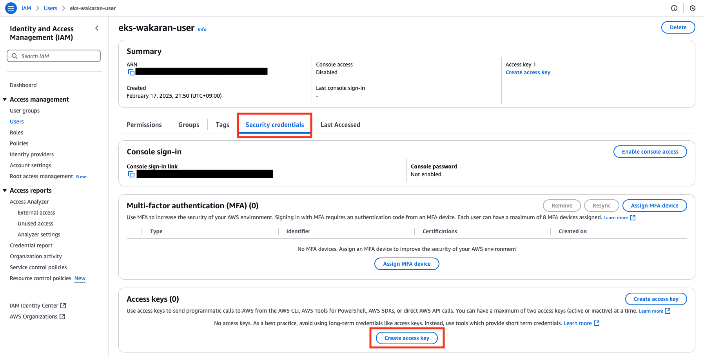
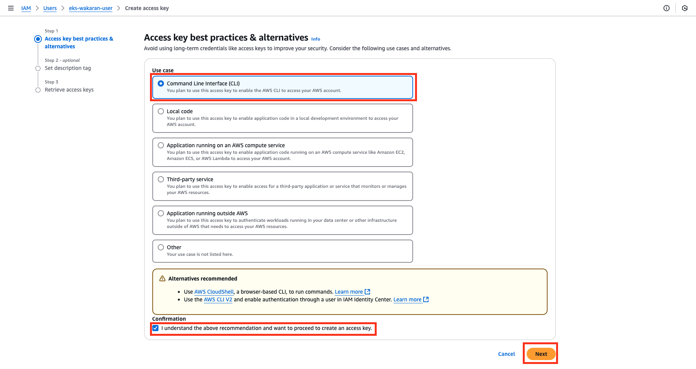

# ハンズオン内容

## 0. ハンズオン準備

### 0-1. codespaceの起動

左上のボタンをクリックし、「`Codespaces`」をクリックします。


「`New codespace`」をクリックします。


`Repository`にて

```
k8s-meetup-novice/eks-handson-20250218
```

を選択し、「`Create codespace`」をクリックします。


### 0-2. IAMユーザーの作成
[AWSマネジメントコンソール](https://aws.amazon.com/jp/console/)にルートユーザーでログインします。
※本手順はルートユーザーでの操作を前提としていますが、IAM操作権限を持つ既存のIAMユーザーでも実施可能です。その場合は、ご利用中のIAMユーザーで以降の手順を進めてください。


画面左上の検索ウィンドウに

```
iam
```

と入力し、`Services`から「`IAM`」を選択します。


「`Users`」 > 「`Create user`」を選択します。


「`User name`」に

```
eks-wakaran-user
```

を指定し、「`Next`」を選択します。


「`Attach policies directly`」を選択し、検索ウィンドウに

```
AdministratorAccess
```

を入力します。
入力後、検索条件に合致したポリシー一覧が表示されるため、「`AdministratorAccess`」にチェックを入れ、「`Next`」を選択します。


確認画面が表示されるため、「`Create user`」を選択します。


`Users`の一覧に作成した`eks-wakaran-user`が表示されていることを確認します。


### 0-3. AWSの認証情報払い出し

`Users`の一覧にて`eks-wakaran-user`を選択し、詳細画面に移動します。
「`Security credentials`」タブを選択後「`Access keys`」までスクロールダウンし、「`Create access key`」を選択します。




<!--  -->


「`Command Line Interface (CLI)`」を選択し、一番下のチェックボックスにチェックを入れ、「`Next`」を選択します。



「`Description tag value`」に

```
eks-wakaran-handson
```

と入力し、「`Create access key`」を選択します。


表示された「`Access key`」および「`Secret access key`」を控え、「`Download .csv file`」を選択した後、「`Done`」を選択します。
※シークレットアクセスキーはこの画面を閉じると二度と参照できなくなるため、必ずこの時点でファイルをダウンロードしてください。なお、ダウンロードしたファイルには機密情報が含まれているため、取り扱いには十分注意してください。

ここで取得したAWSアクセスキー情報は、以降のハンズオン手順でGitHub Codespace内のターミナルから実行するコマンドで使用します。
アクセスキー情報は安全に保管し、次のステップで環境変数として設定します。


`eks-wakaran-user`の詳細画面にて、`Access keys`が作成されたことを確認します。


## 1. EKSおよびECR, S3の作成

以下のコマンドを用いて、環境変数を設定します。
```bash
export AWS_ACCESS_KEY_ID=<Access keyを入力>
export AWS_SECRET_ACCESS_KEY=<Secret access keyを入力>
export AWS_DEFAULT_REGION=ap-northeast-1
export TF_VAR_aws_access_key="${AWS_ACCESS_KEY_ID}"
export TF_VAR_aws_secret_key="${AWS_SECRET_ACCESS_KEY}"
```

以下のコマンドを実行します。
```bash
cat << EOF
AWS_ACCESS_KEY_ID:      ${AWS_ACCESS_KEY_ID}
AWS_SECRET_ACCESS_KEY:  ${AWS_SECRET_ACCESS_KEY}
AWS_DEFAULT_REGION:     ${AWS_DEFAULT_REGION}
TF_VAR_aws_access_key:  ${TF_VAR_aws_access_key}
TF_VAR_aws_secret_key:  ${TF_VAR_aws_secret_key}
EOF
```

コマンドを実行した結果、以下のように環境変数に認証情報が設定されていることを確認します。
```
AWS_ACCESS_KEY_ID:      *********************************************
AWS_SECRET_ACCESS_KEY:  *********************************************
AWS_DEFAULT_REGION:     ap-northeast-1
TF_VAR_aws_access_key:  *********************************************
TF_VAR_aws_secret_key:  *********************************************
```

以下のコマンドを実行し、正しく認証が行えることを確認します。

```bash
aws sts get-caller-identity
```

認証が正しく行えた場合は、以下のような出力が得られます。

```
{
    "UserId": "**************************",
    "Account": "***************",
    "Arn": "********************"
}
```

なお、認証が正しく行えなかった場合は、以下のようなエラーが出力されます。
`Access key`および`Secret access key`が正しく設定されているか再度確認してください。

```
An error occurred (SignatureDoesNotMatch) when calling the GetCallerIdentity operation: The request signature we calculated does not match the signature you provided. Check your AWS Secret Access Key and signing method. Consult the service documentation for details.
```


以下のコマンドを用いて、リソース作成計画が「`Plan: 62 to add, 0 to change, 0 to destroy.`」という形で表示されることを確認します。

```bash
cd /workspaces/eks-handson-20250218/tffiles
make plan
```

次に、`make apply`コマンドを用いてリソースの作成を実行します。

```bash
make apply
```

以下のような確認が求められるので`yes`と入力します。

```
...
Do you want to perform these actions?
  Terraform will perform the actions described above.
  Only 'yes' will be accepted to approve.

  Enter a value: yes <--- ここでyesと入力してください
```

コマンドの実行が正常に完了すると、以下のように表示されます。(コマンドの実行には約10~15分程度要します。)

```
Apply complete! Resources: 62 added, 0 changed, 0 destroyed.

Outputs:

cluster_endpoint = "https://XXXXXXX.ap-northeast-1.eks.amazonaws.com"
cluster_name = "eks-wakaran-handson-cluster"
cluster_security_group_id = "sg-XXXXXXXXX"
region = "ap-northeast-1"
```

AWSマネジメントコンソールにて、`EKS`および`ECR`, `S3バケット`が作成されたことを確認します。


## 2. EKSへのアクセス

以下のコマンドを用いて、`EKSクラスタ`(Kubernetesクラスタ)に対する認証情報(`kubeconfig`)を取得します。

```bash
aws eks update-kubeconfig --name eks-wakaran-handson-cluster
```

`kubectl`コマンドを用いて`Node`一覧が表示されることを確認します。

```bash
kubectl get nodes
```
```
NAME                                              STATUS   ROLES    AGE   VERSION
ip-172-17-1-126.ap-northeast-1.compute.internal   Ready    <none>   17m   v1.30.8-eks-aeac579
ip-172-17-3-204.ap-northeast-1.compute.internal   Ready    <none>   18m   v1.30.8-eks-aeac579
```

## 3. アプリケーションのデプロイ及びLBを用いた外部公開

### 3-1. Load Balancer Controllerのデプロイ

`scripts`ディレクトリに移動し、`deploy_lb_controller.sh`を実行します。

```bash
cd /workspaces/eks-handson-20250218/scripts
bash deploy_lb_controller.sh
```

`aws-load-balancer-controller`で始まる`Pod`が作成され、全ての`STATUS`が`Running`であることを確認します。
```bash
kubectl get pods -n kube-system -l app.kubernetes.io/name=aws-load-balancer-controller
```
```
NAME                                            READY   STATUS    RESTARTS   AGE
aws-load-balancer-controller-6d6c5d67f6-682xv   1/1     Running   0          53s
aws-load-balancer-controller-6d6c5d67f6-s8vkq   1/1     Running   0          53s
```


### 3-2. Podのデプロイ

`nginx`の[Pod](https://kubernetes.io/docs/concepts/workloads/pods/)を作成します。

```bash
kubectl run nginx --image nginx -n default
```

`Pod`が正常に起動し、`STATUS`が`Running`であることを確認します。

```bash
kubectl get pods nginx
```
```
NAME    READY   STATUS    RESTARTS   AGE
nginx   1/1     Running   0          97s
```

### 3-3. Serviceの作成と外部公開
次に作成した`nginx`の`Pod`に対して外部からアクセスするための[Service](https://kubernetes.io/docs/concepts/services-networking/service/)を作成します。

`scripts`ディレクトリに格納されている`service.yaml`マニフェストファイルを確認します。

```yaml
apiVersion: v1
kind: Service
metadata:
  name: nginx
  namespace: default
  annotations:
    service.beta.kubernetes.io/aws-load-balancer-type: "external"
    service.beta.kubernetes.io/aws-load-balancer-nlb-target-type: "instance"
    service.beta.kubernetes.io/aws-load-balancer-scheme: "internet-facing"
  labels:
    run: nginx
spec:
  ports:
  - port: 80
    protocol: TCP
    targetPort: 80
  selector:
    run: nginx
  type: LoadBalancer
```

このマニフェストを適用すると、Kubernetesの`Service`が作成され、それに紐付く`LoadBalancer`([Network Load Balancer](https://docs.aws.amazon.com/elasticloadbalancing/latest/network/introduction.html))が作成されます。

```bash
kubectl apply -f service.yaml
```

`kubectl`を用いて`Service`リソースを参照し、`EXTERNAL-IP`に表示されているFQDNを確認します。
このFQDNが、`Service`を経由して外部から`Pod`にアクセスするための`LoadBalancer`のエンドポイントとなります。

```bash
kubectl get svc nginx
```

```
NAME    TYPE           CLUSTER-IP       EXTERNAL-IP                                                                      PORT(S)        AGE
nginx   LoadBalancer   10.100.136.127   k8s-default-nginx-xxxxxxxxxxxxxxxxxxxxxxxxxxx.elb.ap-northeast-1.amazonaws.com   80:31995/TCP   3m3s
```


AWSマネジメントコンソールから、`Load Balancer`の`Status`が`Active`になったことを確認します。
※`Load Balancer`の`Status`確認は、検索ウィンドウで「`EC2`」を検索し、「`Load Balancers`」を選択することで行えます。


取得したFQDNにアクセスし、`nginx`の画面が表示されることを確認します。


## 4. ECRに格納したコンテナイメージの使用
AWSの提供するコンテナレジストリサービス[ECR(Elastic Container Registry)](https://docs.aws.amazon.com/AmazonECR/latest/userguide/what-is-ecr.html)に格納したコンテナイメージをEKS上で利用します。

[Docker Hub](https://hub.docker.com/_/nginx)から`nginx`のコンテナイメージを取得します。

```bash
docker pull nginx
```

`aws cli`と`docker cli`を用いて、`ECR`にログインします。

```bash
ACCOUNT_ID=`aws sts get-caller-identity | jq -r '.Account'`
aws ecr get-login-password --region ap-northeast-1 | docker login --username AWS --password-stdin ${ACCOUNT_ID}.dkr.ecr.ap-northeast-1.amazonaws.com
```

Pullしたコンテナイメージに[イメージタグ](https://docs.docker.com/reference/cli/docker/image/tag/)を付与します。

```bash
docker tag nginx ${ACCOUNT_ID}.dkr.ecr.ap-northeast-1.amazonaws.com/eks-wakaran-handson-ecr:aws-waiwai
```

`ECR`にローカルのコンテナイメージをPushします。

```bash
docker push ${ACCOUNT_ID}.dkr.ecr.ap-northeast-1.amazonaws.com/eks-wakaran-handson-ecr:aws-waiwai
```

AWSマネジメントコンソールから、`ECR`にコンテナイメージが格納されていることを確認します。
※`ECR`の確認は、検索ウィンドウで「`ECR`」を検索し、「`Elastic Container Registry`」を選択することで行えます。


最後に、`ECR`に格納したコンテナイメージをEKS上で利用します。
以下のコマンドでは`ECR`に格納したコンテナイメージ(`eks-wakaran-handson-ecr:aws-waiwai`)を指定して、EKSに`Pod`を作成します。

```bash
kubectl run nginx-from-ecr --image ${ACCOUNT_ID}.dkr.ecr.ap-northeast-1.amazonaws.com/eks-wakaran-handson-ecr:aws-waiwai
```

作成した`Pod`が起動していることを確認します。

```bash
kubectl get pods nginx-from-ecr
```
```
NAME             READY   STATUS    RESTARTS   AGE
nginx-from-ecr   1/1     Running   0          56s
```

## 5. IRSA
`EKS`では[IRSA](https://docs.aws.amazon.com/eks/latest/userguide/iam-roles-for-service-accounts.html)と呼ばれる仕組みにより、Kubernetesの[ServiceAccount](https://kubernetes.io/docs/concepts/security/service-accounts/)にAWSの`IAMロール`を紐づけることで、`Pod`からAWSのサービスにアクセスすることができます。
ここでは`IRSA`を利用して、`EKS`にデプロイした`Pod`から`S3のバケット`にアクセスします。

以下のコマンドを用いて、`S3バケット`名を取得します。

```bash
S3_BUCKET_NAME=$(aws s3 ls | grep eks-wakaran-handson-s3 | awk '{print $3}')
```

`echo`コマンドを用いて、`S3バケット`名が取得できていることを確認します。

```bash
echo $S3_BUCKET_NAME
```
```
eks-wakaran-handson-s3-*****
```

`S3バケット`(`eks-wakaran-handson-s3-*****`)に`test.txt`というファイルを格納します。

```bash
touch test.txt
aws s3 cp test.txt s3://${S3_BUCKET_NAME}
```
```
upload: ./test.txt to s3://eks-wakaran-handson-s3-*****/test.txt
```

`S3バケット`にファイルがアップロードされていることを確認します。
※`S3バケット`の確認は、検索ウィンドウで「`S3`」を検索し、`S3バケット名`(`eks-wakaran-handson-s3-*****`)を選択することで行えます。


それでは、`Pod`から`S3バケット`を参照できるか確認しましょう。
以下のコマンドを用いて、マニフェストを作成します。

```bash
cat << EOF > pod-before.yaml
apiVersion: v1
kind: Pod
metadata:
  name: pod-before
  namespace: default
spec:
  containers:
    - name: my-aws-cli
      image: amazon/aws-cli:latest
      args: ['s3', 'ls', '${S3_BUCKET_NAME}']
  restartPolicy: Never
EOF
```

`pod-before.yaml`というマニフェストファイルが、`scripts`ディレクトリに保存されます。
```yaml
apiVersion: v1
kind: Pod
metadata:
  name: pod-before
  namespace: default
spec:
  containers:
    - name: my-aws-cli
      image: amazon/aws-cli:latest
      args: ['s3', 'ls', 'eks-wakaran-handson-s3-*****']
  restartPolicy: Never
```

このマニフェストを適用します。

```bash
kubectl apply -f pod-before.yaml
```

`Pod`の`STATUS`が`Error`となっていることを確認します。

```bash
kubectl get pods pod-before
```
```
NAME         READY   STATUS   RESTARTS   AGE
pod-before   0/1     Error    0          43s
```

以下のコマンドを用いて`Pod`のログを確認ます。
```bash
kubectl logs pod-before
```
```
An error occurred (AccessDenied) ... is not authorized to perform: s3:ListBucket on resource: "arn:aws:s3:::eks-wakaran-handson-s3-xxxxx" because no identity-based policy allows the s3:ListBucket action
```

これは、この`Pod`に`S3バケット`を参照する権限がないことを示しています。

次に`IRSA`の仕組みを利用して同じことを行います。
まず、`IAM OIDCプロバイダー`を作成します。

```bash
eksctl utils associate-iam-oidc-provider --region=ap-northeast-1 --cluster=eks-wakaran-handson-cluster --approve
```

次に`Pod`から`S3バケット`の参照が行えるよう、`IRSA`を利用するための`ServiceAccount`と`IAMロール`を`eksctl`コマンドを用いて作成します。
このサービスアカウントに紐づく`IAMロール`には、「`AmazonS3ReadOnlyAccess`(`S3読み取り許可`)」ポリシーをアタッチしています。

```bash
eksctl create iamserviceaccount \
  --name eks-wakaran-handson-sa \
  --namespace default \
  --cluster eks-wakaran-handson-cluster \
  --approve \
  --attach-policy-arn $(aws iam list-policies --query 'Policies[?PolicyName==`AmazonS3ReadOnlyAccess`].Arn' --output text) 
```
  
以下のような結果が出力されることを確認します。
```
2025-02-17 14:55:35 [ℹ]  created serviceaccount "default/eks-wakaran-handson-sa"
```

以下のコマンドを用いて、`ServiceAccount`が正常に作成されたことを確認します。

```
kubectl get sa eks-wakaran-handson-sa
```
```
NAME                     SECRETS   AGE
eks-wakaran-handson-sa   0         119s
```


それでは、作成した`ServiceAccount`を紐づけた`Pod`を新たに起動します。
以下のコマンドを用いて、マニフェストを作成します。

```bash
cat << EOF > pod-after.yaml
apiVersion: v1
kind: Pod
metadata:
  name: pod-after
  namespace: default
spec:
  serviceAccountName: eks-wakaran-handson-sa
  containers:
    - name: my-aws-cli
      image: amazon/aws-cli:latest
      args: ['s3', 'ls', '${S3_BUCKET_NAME}']
  restartPolicy: Never
EOF
```

`pod-after.yaml`というマニフェストファイルが、`scripts`ディレクトリに保存されます。
```yaml
apiVersion: v1
kind: Pod
metadata:
  name: pod-after
  namespace: default
spec:
  serviceAccountName: eks-wakaran-handson-sa
  containers:
    - name: my-aws-cli
      image: amazon/aws-cli:latest
      args: ['s3', 'ls', 'eks-wakaran-handson-s3-*****']
  restartPolicy: Never
```

このマニフェストを適用します。
```bash
kubectl apply -f pod-after.yaml
```

作成した`Pod`の`Status`が`Completed`となっていることを確認します。

```bash
kubectl get pods pod-after
```
```
NAME        READY   STATUS      RESTARTS   AGE
pod-after   0/1     Completed   0          14s
```

以下のコマンドを用いて`Pod`のログを確認し、`S3バケット`を参照できたことを確認します。

```bash
kubectl logs pod-after
```
```
2025-02-17 14:43:02          0 test.txt
```

## 6. クリーンアップ

1. `ECR`に格納されているコンテナイメージの削除
2. `S3バケット`内にあるファイルの削除
3. `Service`の削除

```bash
cd /workspaces/eks-handson-20250218/scripts
kubectl delete -f service.yaml
```

コマンドを実行後、GUIでLoad Balancerが削除されていることを確認します。

4. リソースの削除

```bash
cd /workspaces/eks-handson-20250218/tffiles
make destroy
```
```
Do you really want to destroy all resources?
  Terraform will destroy all your managed infrastructure, as shown above.
  There is no undo. Only 'yes' will be accepted to confirm.

  Enter a value: yes <--- ここでyesと入力してください
```

5. `IAM`の`Policies`及び`Roles`にて、「`wakaran`」というワードの入った名前のリソースを削除

6. `IAM`の`Users`にてハンズオンに使用したユーザー(`eks-wakaran-user`)を削除

7. `Resource Groups & Tag Editor`にて、`Project: eks-wakaran`というタグが付与されたリソースを削除(「`(補足) リソースが削除されたことの確認方法`」参照)

7. `codespace`の削除


### (補足) リソースが削除されたことの確認方法
本ハンズオンで作成した全てのリソースには`Project: eks-wakaran`というタグが付与されています。
[Resource Groups & Tag Editor](https://docs.aws.amazon.com/tag-editor/latest/userguide/tagging.html)を用いて該当タグが付与されたリソースを検索し、全てのリソースが削除されていることを確認することができます。

画面左上の検索ウィンドウに

```
Resource Groups
```

と入力し、Servicesから「`Resource Groups & Tag Editor`」を選択します。


「`Tag Editor`」を選択します。


検索条件に
- `Regions`:            `All regions`
- `Resource types`:     `All supported resource types`
- `Tag key`:            `Project`
- `Optional tag value`: `eks-wakaran`
を入力し、「`Search resources`」を選択します。

「`Resource search results`」に何も表示されなければ、ハンズオンに使用した全てのリソースの削除が完了していることになります。
`6. クリーンアップ`を実施後になんらかのリソースが残存しているようであれば、手動でリソースの削除を行なってください。

